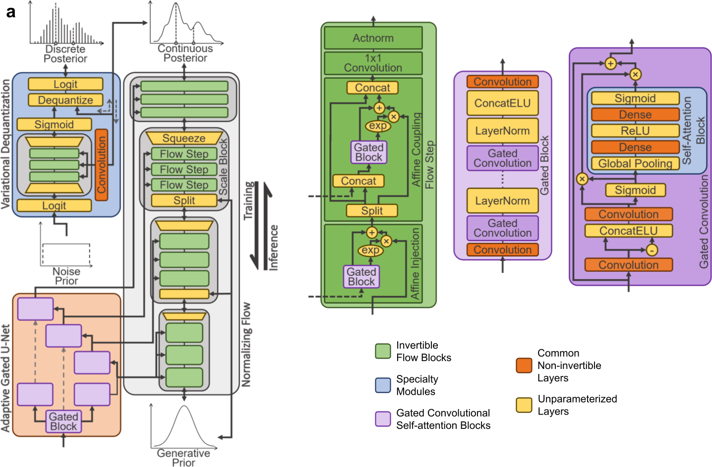
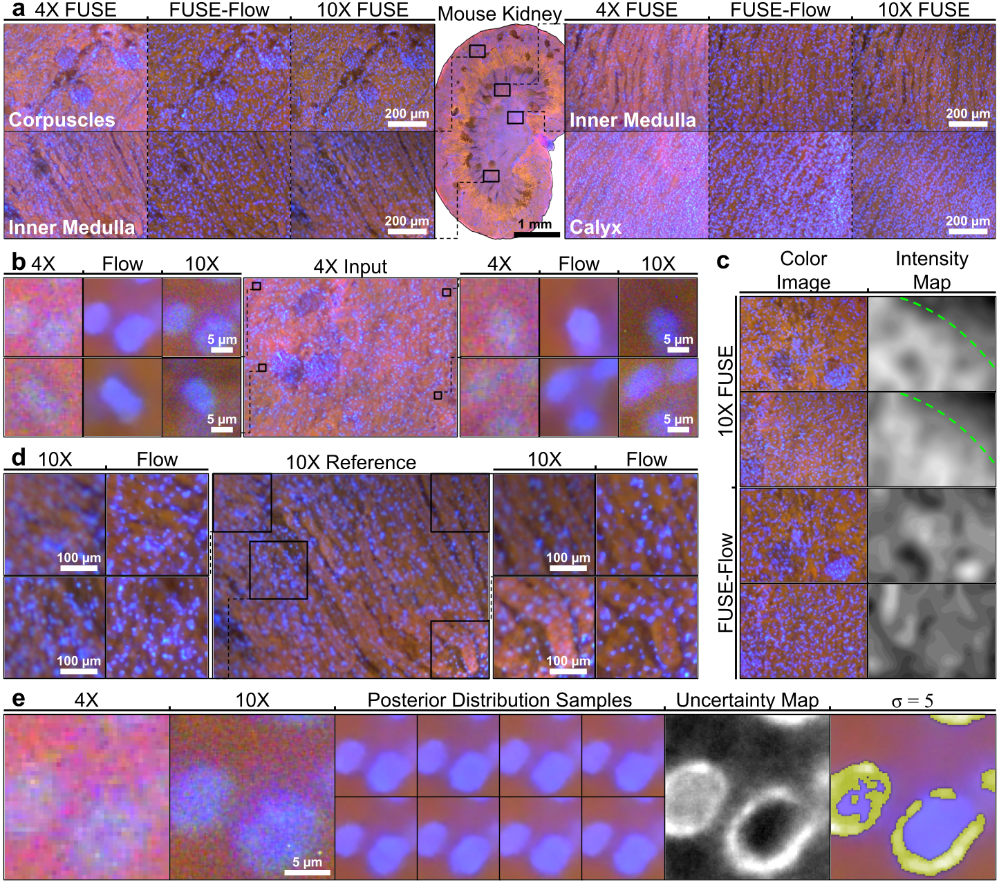
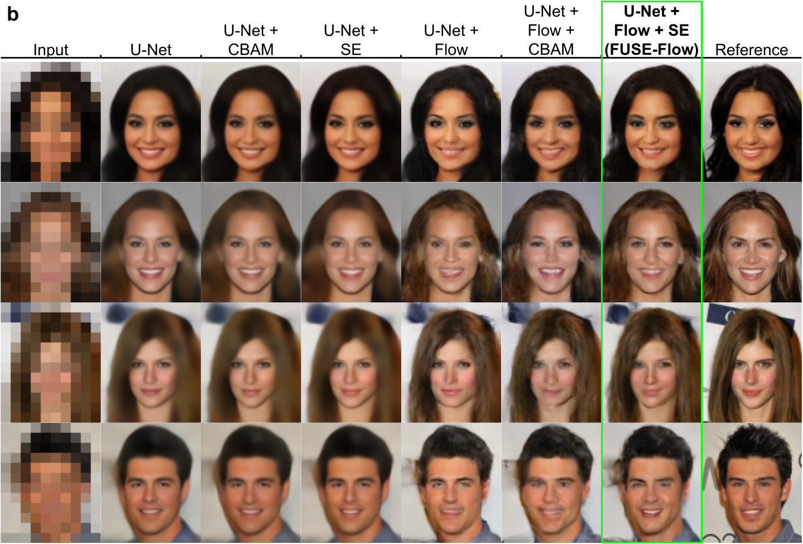
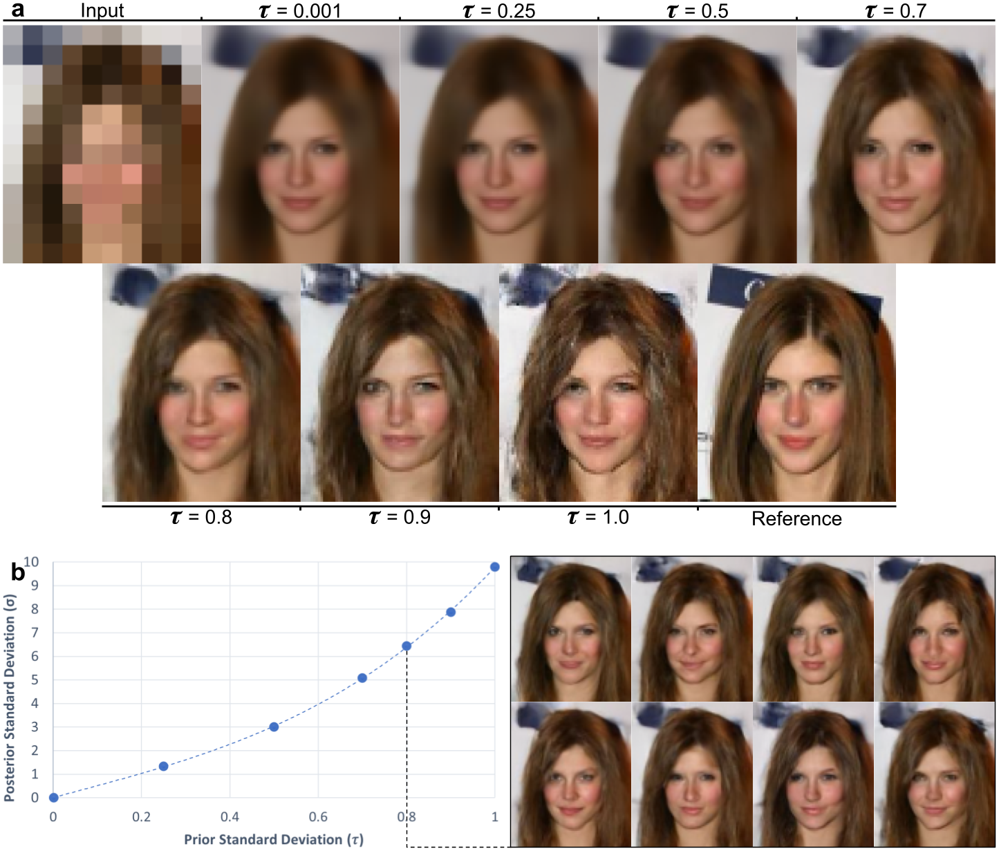

# FUSE-Flow

## Multi-scale tissue fluorescence mapping with fibre optic ultraviolet excitation and generative modelling
[[bioRxiv](https://www.biorxiv.org/content/10.1101/2022.12.28.521919v3)], [[KaichengGroup](https://liangresearch.com/)]

Joel Lang Yi Ang*, Ko Hui Tan*, Alexander Si Kai Yong*, Chiyo Wan Xuan Tan, Jessica Sze Jia Kng, Cyrus Jia Jun Tan, 
Rachael Hui Kie Soh, Julian Yi Hong Tan, Kaicheng Liang

*Equal contribution

### Abstract
Cellular imaging of thick samples requires physical sectioning or laser scanning microscopy, 
generally incompatible with high-throughput requirements. We developed fibre optic microscopy 
with ultraviolet (UV) surface excitation (FUSE), a portable, quantitative fluorescence imaging 
platform for thick tissue that substantially advances prior UV excitation approaches with 
illumination engineering and computational methods. Optic fibres delivered <300nm light with 
directional control, enabling unprecedented 50X widefield imaging on thick tissue with sub-nuclear 
clarity, and 3D topography of surface microstructure. Generative modelling of high-magnification 
images using our normalising flow architecture FUSE-Flow (open-source) enhanced low-magnification 
imaging by variational inference. Comprehensive validation comprised multi-scale fluorescence 
histology compared with standard H\&amp;E, and quantitative analyses of senescence, antibiotic 
toxicity, and nuclear DNA content in tissue models via efficient sampling of entire murine organs 
by thick slices up to 0.4x8x12mm and 1.3 million cells per surface. This technology addresses 
long-standing laboratory gaps for high-throughput studies for rapid cellular insights.

### BibTex
```
@article{ang_multi-scale_2023,
	title = {Multi-scale tissue fluorescence mapping with fibre optic ultraviolet excitation and generative modelling},
	url = {https://www.biorxiv.org/content/early/2023/10/19/2022.12.28.521919},
	doi = {10.1101/2022.12.28.521919},
	abstract = {Cellular imaging of thick samples requires physical sectioning or laser scanning microscopy, generally incompatible with high-throughput requirements. We developed fibre optic microscopy with ultraviolet (UV) surface excitation (FUSE), a portable, quantitative fluorescence imaging platform for thick tissue that substantially advances prior UV excitation approaches with illumination engineering and computational methods. Optic fibres delivered \&lt;300nm light with directional control, enabling unprecedented 50X widefield imaging on thick tissue with sub-nuclear clarity, and 3D topography of surface microstructure. Generative modelling of high-magnification images using our normalising flow architecture FUSE-Flow (open-source) enhanced low-magnification imaging by variational inference. Comprehensive validation comprised multi-scale fluorescence histology compared with standard H\&amp;E, and quantitative analyses of senescence, antibiotic toxicity, and nuclear DNA content in tissue models via efficient sampling of entire murine organs by thick slices up to 0.4x8x12mm and 1.3 million cells per surface. This technology addresses long-standing laboratory gaps for high-throughput studies for rapid cellular insights.Competing Interest StatementThe authors have declared no competing interest.},
	journal = {bioRxiv},
	author = {Ang, Joel Lang Yi and Tan, Ko Hui and Yong, Alexander Si Kai and Tan, Chiyo Wan Xuan and Kng, Jessica Sze Jia and Tan, Cyrus Jia Jun and Soh, Rachael Hui Kie and Tan, Julian Yi Hong and Liang, Kaicheng},
	year = {2023},
	note = {Publisher: Cold Spring Harbor Laboratory
\_eprint: https://www.biorxiv.org/content/early/2023/10/19/2022.12.28.521919.full.pdf},
}
```

## Model

</img>

>- Normalising flow module
>  - Scale Block
>    - Squeeze Step
>    - Transition Step
>      - Activation Normalization
>      - Invertible 1x1 Convolution
>    - Conditional Flow Step
>      - Activation Normalization
>      - Invertible 1x1 Convolution
>      - Conditional Affine Injector
>      - Conditional Affine Coupling
>    - Split Step
>- Adaptive Gated U-Net
>  - Gated ResNet
>  - Squeeze-and-Excitation
>  - Concat ELU
>  - Layer Normalization
>- Variational Dequantization Module
>  - Variational perturbation

## Results

</img>

>a. Performance overview on fluorescent histological images (held-out) of fresh mouse kidney slice. 
> FUSE-Flow performed domain alignment of input 4X images to reference images in colour and detail 
> while preserving input's coarser features like nuclei positioning and tissue texture.\
>b. FUSE-Flow enhanced nuclear margin sharpness and increased contrast between nuclei and cytoplasm.\
>c. 10X images displayed clear bias in upper right corner due to non-uniform illumination. Bias was 
> absent in model-enhanced images as evidenced by intensity maps correctly corresponding to tissue 
> features.\
>d. FUSE-Flow outputs show no out-of-focus areas, typically seen in higher-magnification images due 
> to tissue regions falling outside objective depth-of-field.\
>e. Multiple samples ($n=64$) drawn from learnt posterior distribution could estimate conditional 
> standard error to identify regions with highly aleatoric uncertainty. \sigma=5 
> (or p-value$=3e^{-7}$) was highlighted.

</img>
</img>

>- Ablation study on CelebA dataset.

## Getting Started

### _configurations.yaml_

Hyperparameters, architecture modifications, and configurations for training and testing are defined 
in a _configurations.yaml_ text file. The file is _.gitignore_'ed for commit cleanliness, so you'll 
have to create your own. Below are the defaults.
```yaml
ablation:
  no_pretrain: false  # do not load weights of pre-trained u-net from models/pretrain_unet/weights.pth
  no_freeze: false  # do not freeze u-net during training of normalizing flow
  no_flow: false  # no normalizing flow, only u-net
  no_autoencoder: false  # no u-net, only normalizing flow
  no_augmentation: false  # no augmentations as defined in data_modules/augmentation.py
  no_transition: false  # no transitional steps as defined in SRFlow 
  no_actnorm: false  # no actnorm in flow step
  no_1x1_conv: false  # no invertible 1x1 convolution in flow step
  no_injection: false  # no affine injection in flow step
  no_coupling: false  # no affine coupling in flow step
  logistic_coupling: false  # use logistic coupling as defined in Flow++. this isn't working yet
  no_skip: false  # no skip connections in u-net
  autoencoder_loss: bce  # loss function for u-net if no normalizing flow. accepts: bce, l1, l2
  dequantization: var  # either variation dequantization, basic floor dequantization, or none. accepts: var, basic, none
  attention_type: se  # type of self-attention mechanism. accepts: se, cbam, none
augmentations:
  hor_flip: true  # horizontal flip
  ver_flip: false  # vertical flip
  col_jig: false  # color jiggle
hyper-parameters:
  factor: 2  # factor at which dimensions are scaled. currently only works with 2
  flow:
    n_scale_add: 0  # additional reduction in dimensions to in mapping to prior beyond what is minimally required. max value for CelebA is 1, max value for CIFAR10 is 6.
    n_step: 4  # number of flow steps in each scale block
  autoencoder:
    c_u: 128  # number of feature channels passed from u-net to normalizing flow
    n_conv: 32  # number of gated_convolutions in gated_resnet in u-net
    attn_red_ratio: 0.5  # 0-1 slider to adjust influence of attention mechanism
  dequantization:
    n_step: 4  # number of flow steps in scale block in the dequantization module
    n_conv: 0  # additional convolution layers before scale block
  estimators:
    c_u_mult: 6  # number of channels in hidden layers, expressed as multiples of c_u 
    n_conv: 32  # number of gated_convolutions in gated_resnet in parameters estimators in normalizing flow
    attn_red_ratio: 0.5  # 0-1 slider to adjust influence of attention mechanism
  prior_variance: 1.0  # standard deviation of Gaussian prior
  lr: 1.0e-4  # learning rate
  gamma: 0.9  # learning rate decay rate (per epoch)
data:
  dataset: celeb  # sub-folder at data_dir
  data_dir: your_path_here  # path to data
  log_dir: logs  # path to store training and testing logs
training:
  run_name: null  # name of training run. defaults to integer increments
  filename: train  # filename of NPZ file to be used for training
  epochs: 128
  batch_size: 8
  sample_size: null  # sample subset of training data from NPZ. accepts 0-1 float representing proportion or integers representing absolute counts
  log_interval: 4  # log every n-th step
  flush: 16  # flush logs from RAM to txt file every n-th step
testing:
  run_name: null  # name of run to test. defaults to the largest integer filename
  filename: test  # filename of NPZ file to be used for testing
  batch_size: 128
  sample_size: 256  # sample subset of training data from NPZ. accepts 0-1 float representing proportion or integers representing absolute counts  
  posterior_sample_size: 16  # number of samples to generate per prediction
  temperature: [0.0001, 0.5, 0.8, 1.0]  # standard deviation values of Gaussian prior to generate outputs at
```

### Data

We will provide datasets for demo purposes soon.

### Training and testing

    .
    ├── .github/              # Linter
    ├── data/                 # Locally downloaded data (optional)
    │   ├── celeb/            # CelebA dataset
    │   ├── fuse/             # FUSE microscopy dataset
    │   └── ...
    ├── data_modules/         # Ancillary data modules
    ├── FUSE_Flow/            # FUSE-Flow model source code
    ├── misc/                 # Images for README
    ├── utils/                # Utility functions to faciliate training and testing
    ├── .gitignore
    ├── configurations.yaml   # Model configurations
    ├── LICENSE
    ├── README.md
    ├── test.py               # Testing script
    └── train.py              # Training script

> Final file structure.

_train.py_ and _test.py_ can be simply ran once _configuration.yaml_ and _data/_ is implemented.

## Contributing

This repository will continue development through the GitHub Issues tab. If you would like 
to contribute or have any inquiries, feel free to create a pull request or drop Joel an email at 
joel_ang@imcb.a-star.edu.sg. Thank you.

## Acknowledgments

This work was supported by the Singapore National Research Foundation Fellowship (NRFF13-2021-0057) 
and the Agency for Science, Technology and Research (A*STAR).
We would like to thank Dr Chee Bing Ong for his invaluable support and pathology-related consultations, 
Dr Nazihah Husna Abdul Aziz for her input into various experiment designs, 
Zhe Li Ha for her artistic contributions to figure design, 
Li Qin Shen for her contributions to software development for microscope automation, 
Stefanie Zi En Lim and Jeremy Rui Quan Lee for their contributions to data preparation, 
Rachel Yixuan Tan for her contributions to initial mechanical designs, 
and Dr Zesheng Zheng for engineering-related consultations.
We would also like to acknowledge Nikon Imaging Centre (NIC) @ Singapore Bioimaging Consortium (SBIC) 
for their confocal and brightfield imaging system.
